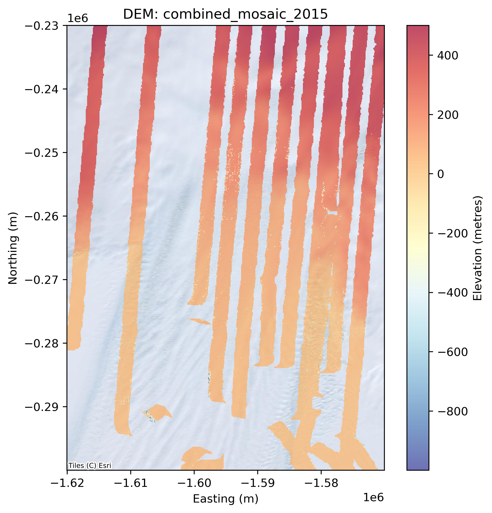
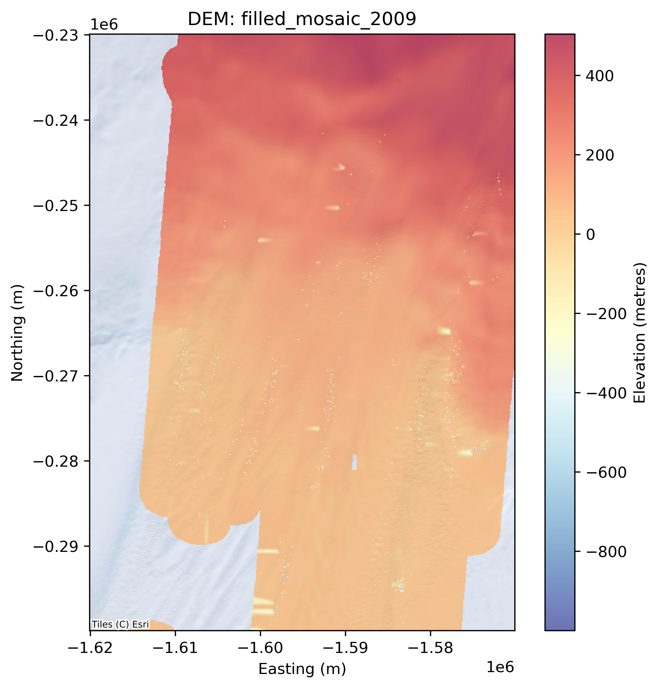
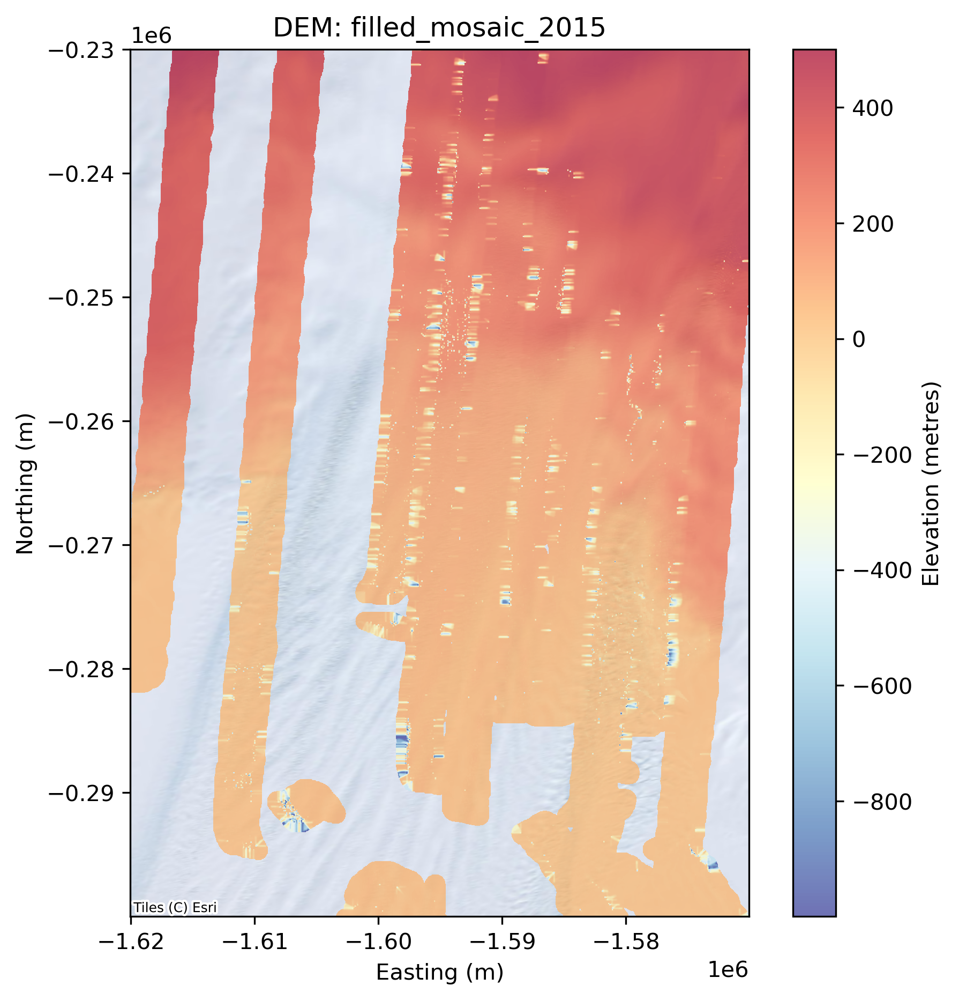

# OOSA Assignment 2025 (Exam No. B273049)
This repository contains Python tools for processing and analysing elevation data from NASA's Land, Vegetation, and Ice Sensor (LVIS), specifically focusing on Level 1B datasets from 2009 and 2015 over Pine Island Glacier in Antarctica. 

The toolkit enables reading raw LVIS waveform data, processing it into raster digital elevation models (DEMs), and generating derived graphical products.

## Task 1: Plot an LVIS Waveform

#### Example command

Run from the **tasks** directory:

```
python task1.py -f /geos/netdata/oosa/assignment/lvis/2009/ILVIS1B_AQ2009_1020_R1408_058456.h5
```
Behaviour:
- If no index is provided (-i argument omitted), the script will:
  1. Display the valid waveform index range (e.g., 0 to N-1)
  2. Prompt you to enter an index interactively:
        ```text
        File contains waveforms with indices 0 to 1247
        Enter waveform index (0-1247) or 'q' to quit: 
        ```
  3. Validate your input against the available range

Example with index specified:

```
python task1.py -f [FILEPATH] -i 15 # Directly plots waveform 15
```

#### Example output


## Task 2: Create a DEM for a specific flight line

#### Example command

```
python task2.py -f /geos/netdata/oosa/assignment/lvis/2009/ILVIS1B_AQ2009_1020_R1408_058456.h5 -s 20 -r 30
```

## Task 3: Process an annual dataset

#### Example command for 2009 data

```
python task3.py -y 2009 -s 20 -r 100
```

#### Example command for 2015 data

```
python task3.py -y 2015 -s 20 -r 100
```

#### Example outputs

- 2009


- 2015



## Task 4: Gap-filling

#### Example command for 2009 data

```
python task4.py -y 2009
```

#### Gap filling with different parameters

```
python task4.py -y 2009 -md 30 -s 5
```


#### Example outputs

- 2009



- 2015



## Task 5: Estimate change in elevation

#### Example command - Basic Usage

```
python task5.py -d1 processed_data/filled_mosaic_2009.tif -d2 processed_data/filled_mosaic_2015.tif
```

#### Example command - With custom output

```
python task5.py -d1 processed_data/filled_mosaic_2009.tif -d2 processed_data/filled_mosaic_2015.tif -o change_map.tif
```

#### Example output

